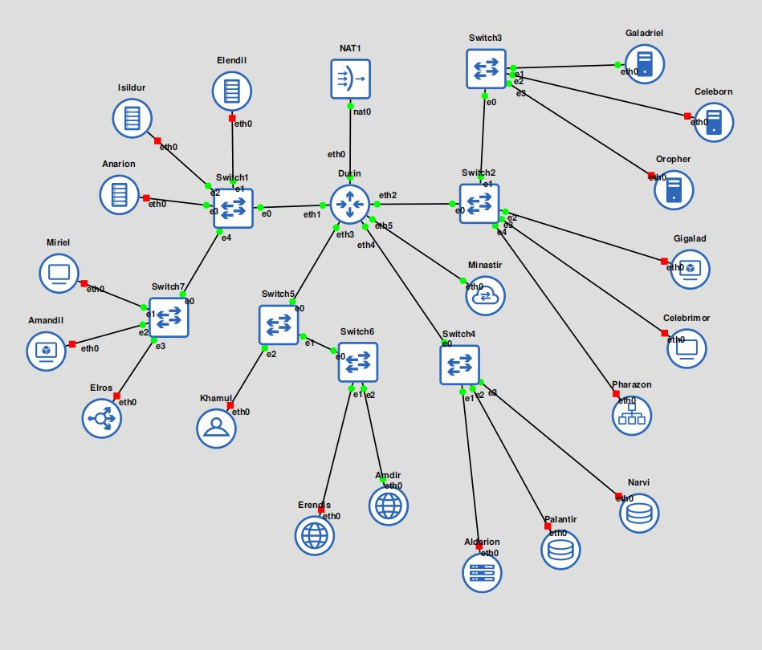
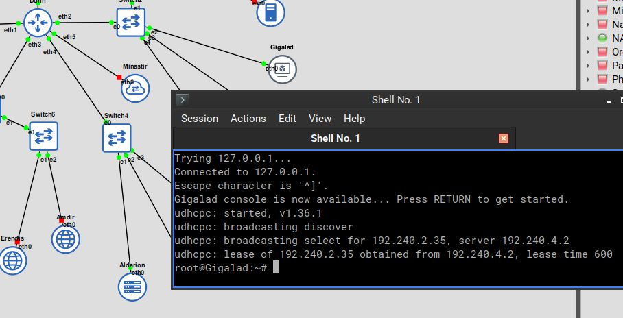
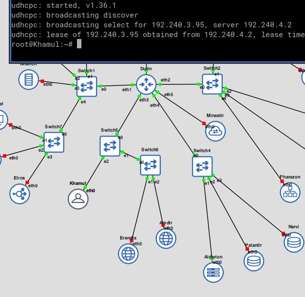
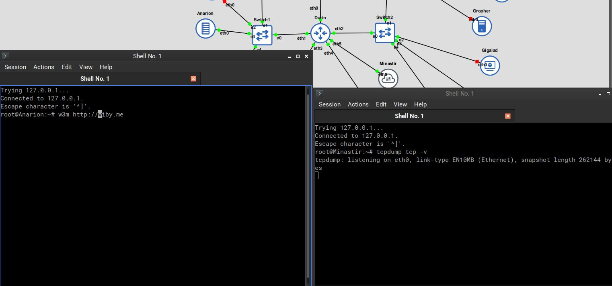
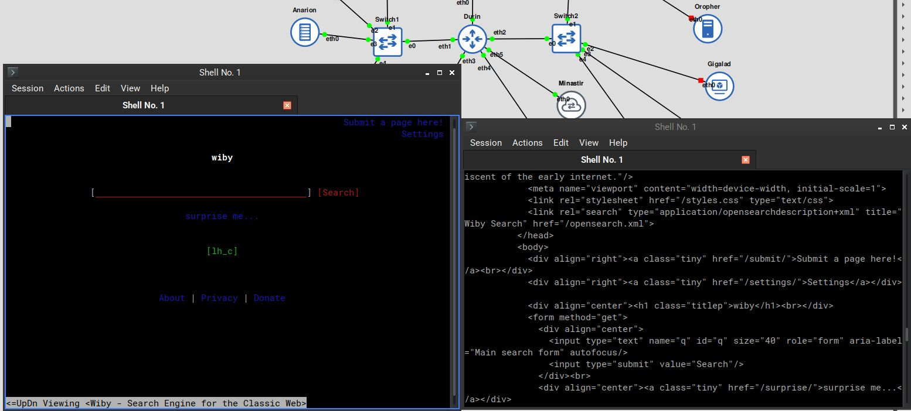
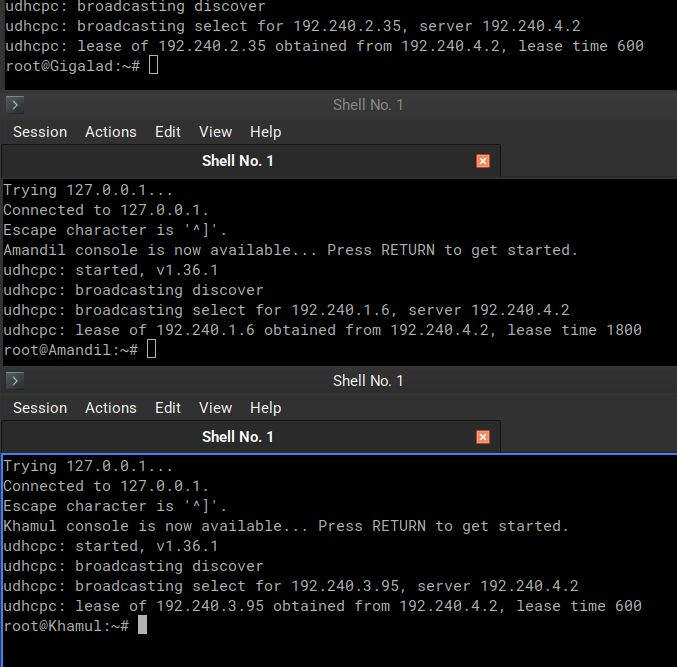
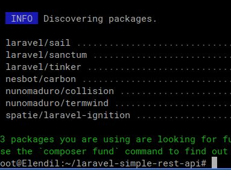

# Jarkom-Modul-2-2025-K58

| Nama                        | NRP        |
| --------------------------- | ---------- |
| Thio Billy Amansyah         | 5027231007 |
| Ivan Syarifuddin            | 5027241045 | 

## No.1
**SOAL:** Di awal Zaman Kedua, setelah kehancuran Beleriand, para Valar menugaskan untuk membangun kembali jaringan komunikasi antar kerajaan. Para Valar menyalakan Minastir, Aldarion, Erendis, Amdir, Palantir, Narvi, Elros, Pharazon, Elendil, Isildur, Anarion, Galadriel, Celeborn, Oropher, Miriel, Amandil, Gilgalad, Celebrimbor, Khamul, dan pastikan setiap node (selain Durin sang penghubung antar dunia) dapat sementara berkomunikasi dengan Valinor/Internet (nameserver 192.168.122.1) untuk
menerima instruksi awal


**PENJELASAN:** Bentuk topologi sesuai contoh. 



Berikan Ip address static pada sambungan router (Durin) dengan subnet2nya, lalu tentukan Ip dynamic pada sambungan router ke nat serta tetapkan `192.168.122.1` sebagai resolver

```
# DHCP config for eth0
auto eth0
iface eth0 inet dhcp

# Static config for eth1
auto eth1
iface eth1 inet static
	address 192.240.1.1
	netmask 255.255.255.0

# Static config for eth2
auto eth2
iface eth2 inet static
	address 192.240.2.1
	netmask 255.255.255.0

# Static config for eth3
auto eth3
iface eth3 inet static
	address 192.240.3.1
	netmask 255.255.255.0

# Static config for eth4
auto eth4
iface eth4 inet static
	address 192.240.4.1
	netmask 255.255.255.0

# Static config for eth5
auto eth5
iface eth5 inet static
	address 192.240.5.1
	netmask 255.255.255.0
	up echo nameserver 192.168.122.1 > /etc/resolv.conf
```

Berikan IP address static pada setiap node client dan server. Lalu tetapkan `192.168.122.1` sebagai resolver

```
# Static config for eth0
auto eth0
iface eth0 inet static
	address 192.240.1.4
	netmask 255.255.255.0
	gateway 192.240.1.1
	up echo nameserver 192.168.122.1 > /etc/resolv.conf
```

Masukkan iptables rule pada router (Durin) agar bisa menjadi nat device dan meneruskan paket ke internet. .

```
iptables -t nat -A POSTROUTING -o eth0 -j MASQUERADE -s 192.240.0.0/16
```

Testing.

```
root@Erendis:~# ping -c1 wiby.me
PING wiby.me (172.93.49.252) 56(84) bytes of data.
64 bytes from b2.soutocontabilidade.com (172.93.49.252): icmp_seq=1 ttl=39 time=358 ms

--- wiby.me ping statistics ---
1 packets transmitted, 1 received, 0% packet loss, time 0ms
rtt min/avg/max/mdev = 358.182/358.182/358.182/0.000 ms
```

## No.2
**SOAL:** Raja Pelaut Aldarion, penguasa wilayah Númenor, memutuskan cara pembagian tanah client secara dinamis. Ia menetapkan:

○ Client Dinamis Keluarga Manusia: Mendapatkan tanah di rentang [prefix ip].1.6 - [prefix ip].1.34 dan [prefix ip].1.68 - [prefix ip].1.94.

○ Client Dinamis Keluarga Peri: Mendapatkan tanah di rentang [prefix ip].2.35 - [prefix ip].2.67 dan [prefix ip].2.96 - [prefix ip].2.121.

○ Khamul yang misterius: Diberikan tanah tetap di [prefix ip].3.95, agar keberadaannya selalu diketahui. Pastikan Durin dapat menyampaikan dekrit ini ke semua wilayah yang terhubung dengannya

**PENJELASAN:** Install dan konfigurasi dhcp server pada node Aldarion.
```
### Konfigurasi /root/.bashrc
[[ "$(dhcpd --version)" ]] || apt update -y && apt install isc-dhcp-server -y

cp -f /root/conf-bak/isc-dhcp-server /etc/default
cp -f /root/conf-bak/dhcpd.conf /etc/dhcp

service isc-dhcp-server start

### KOnfigurasi /etc/default/isc-dhcp-server
INTERFACESv4="eth0"

### KOnfigurasi /etc/dhcp/dhcpd.conf
default-lease-time 600;
max-lease-time 7200;
subnet 192.240.1.0 netmask 255.255.255.0 {
    range 192.240.1.6 192.240.1.34;
    range 192.240.1.68 192.240.1.94;
    option routers 192.240.1.1;
    option domain-name-servers 192.168.122.1;
    option broadcast-address 192.240.1.255;
}

subnet 192.240.2.0 netmask 255.255.255.0 {
    range 192.240.2.35 192.240.2.67;
    range 192.240.2.96 192.240.2.121;
    option routers 192.240.2.1;
    option domain-name-servers 192.168.122.1;
    option broadcast-address 192.240.2.255;
}

subnet 192.240.3.0 netmask 255.255.255.0 { }
subnet 192.240.4.2 netmask 255.255.255.255 { }
host Khamul {
    hardware ethernet 02:42:47:72:aa:00;
    fixed-address 192.240.3.95;
}
```

Install dan konfigurasi dhcp relay pada router (Durin)

```
### Konfigurasi /root/.bashrc
[[ "$(ls /etc/default/isc-dhcp-relay)" ]] || apt update && apt install isc-dhcp-relay -y

cp -f /root/conf-bak/isc-dhcp-relay /etc/default
cp -f /root/conf-bak/sysctl.conf /etc

service isc-dhcp-relay start

iptables -t nat -A POSTROUTING -o eth0 -j MASQUERADE -s 192.240.0.0/16

### Konfigurasi /etc/default/isc-dhcp-relay
# What servers should the DHCP relay forward requests to?
SERVERS="192.240.4.2"

# On what interfaces should the DHCP relay (dhrelay) serve DHCP requests?
INTERFACES="eth4 eth3 eth2 eth1"

### Isi file /etc/sysctl.conf
net.ipv4.ip_forward=1
```

Testing.






## No.3
**SOAL:** Untuk mengontrol arus informasi ke dunia luar (Valinor/Internet), sebuah menara pengawas, Minastir didirikan. Minastir mengatur agar semua node (kecuali Durin) hanya dapat mengirim pesan ke luar Arda setelah melewati pemeriksaan di Minastir.

**PENJELASAN:** Install dan konfigurasi forward proxy server.

```
### Konfigurasi /root/.bashrc
[[ "$(nginx -v)" ]] || apt update -y && apt install nginx -y

cp -f -t /etc/nginx/sites-enabled/ /root/conf/fprox 

service nginx start

### Isi file /etc/nginx/sites-enabled/fprox
server {

  listen 8080;
  location / {
    resolver 192.240.3.3 192.240.3.2 192.168.122.1;
    proxy_pass http://$http_host$uri$is_args$args;
  }

}
```

Konfigurasi iptables pada router (Durin).

```
### Balasan balik melalui router, bukan langsung ke client
iptables -t nat -A POSTROUTING -o eth0 -j MASQUERADE -s 192.240.0.0/16

### Semua traffic http dialihkan ke proxy
iptables -t nat -A PREROUTING ! -i eth0 ! -s 192.240.5.2 -p tcp --dport 80 -j DNAT --to 192.240.5.2:8080
iptables -t nat -A PREROUTING ! -i eth5 ! -s 192.240.5.2 -p tcp --dport 80 -j DNAT --to 192.240.5.2:8080

### Balasan balik melalui router, bukan langsung ke client
iptables -t nat -A POSTROUTING -o eth0 -s 192.240.0.0/16 -d 192.240.5.2 -j MASQUERADE

### Semua traffic forward ke proxy diperbolehkan lewat
iptables -A FORWARD -s 192.240.0.0/16 -d 192.240.5.2 ! -i eth0 -o eth5 -p tcp --dport 8080 -j ACCEPT
iptables -A FORWARD -s 192.240.0.0/16 -d 192.240.5.2 ! -i eth5 -o eth5 -p tcp --dport 8080 -j ACCEPT
```

Testing.





## No.4
**SOAL:** Ratu Erendis, sang pembuat peta, menetapkan nama resmi untuk wilayah utama (<xxxx>.com). Ia menunjuk dirinya (ns1.<xxxx>.com) dan muridnya Amdir (ns2.<xxxx>.com) sebagai penjaga peta resmi. Setiap lokasi penting (Palantir, Elros, Pharazon, Elendil, Isildur, Anarion, Galadriel, Celeborn, Oropher) diberikan nama domain unik yang menunjuk ke lokasi fisik tanah mereka. Pastikan Amdir selalu menyalin peta (master-slave) dari Erendis dengan setia

**PENJELASAN:** Install dan konfigurasi dns master (Erendis).
```
### Konfigurasi /root/.bashrc
[[ "$(named -v)" ]] || apt update -y && apt install bind9 bind9utils -y
cp -f -t /etc/bind/ /root/conf/*
service named start

### konfigurasi /etc/bind/named.conf.local 
zone "k58.com" {
        type master;
        file "/etc/bind/ns1.k58.com";

        notify yes;
        allow-transfer { 192.240.3.3; };
        also-notify { 192.240.3.3; };
};

### konfigurasi /etc/bind/named.conf.options
options {
        directory "/var/cache/bind";
        listen-on port 53 { localhost; 192.240.0.0/16; };
        dnssec-validation no;
        allow-query { localhost; 192.240.0.0/16; };
        forwarders { 192.168.122.1; };
};

### konfigurasi /etc/bind/ns1.k58.com
$TTL            3h

@               IN      SOA     n1.k58.com.     admin.k58.net. (
                        1       ; Serial
                        3h      ; Refresh
                        1h      ; Retry
                        1w      ; Expire
                        1h      ; Negative caching TTL
                        )

@               IN      NS      ns1.k58.com.
@               IN      NS      ns2.k58.com.

elendil         IN      A       192.240.1.2
isildur         IN      A       192.240.1.3
anarion         IN      A       192.240.1.4
elros           IN      A       192.240.1.4

pharazon        IN      A       192.240.2.3
galadriel       IN      A       192.240.2.4
celeborn        IN      A       192.240.2.5
oropher         IN      A       192.240.2.6

ns1             IN      A       192.240.3.2
ns2             IN      A       192.240.3.3

elwing          IN      A       192.240.4.3
```

INstall dan konfigurasi dns slave (Amdir).

```
### Konfigurasi /root/.bashrc
[[ "$(named -v)" ]] || apt update -y && apt install bind9 bind9utils -y
cp -f -t /etc/bind/ /root/conf/*
service named start

### konfigurasi /etc/bind/named.conf.local 
zone "k58.com" IN {
        type slave;
        masters { 192.240.3.2; };
        file "/var/cache/bind/ns2.k58.com";
};

### konfigurasi /etc/bind/named.conf.options
options {
        directory "/var/cache/bind";
        listen-on port 53 { localhost; 192.240.0.0/16; };
        allow-query { localhost; 192.240.0.0/16; };
        allow-notify { 192.240.3.2; };
        dnssec-validation no;
};
```

Testing.

```
root@Erendis:~# dig @192.240.3.3 elros.k58.com

; <<>> DiG 9.20.15-1~deb13u1-Debian <<>> @192.240.3.3 elros.k58.com
; (1 server found)
;; global options: +cmd
;; Got answer:
;; ->>HEADER<<- opcode: QUERY, status: NOERROR, id: 22364
;; flags: qr aa rd ra; QUERY: 1, ANSWER: 1, AUTHORITY: 0, ADDITIONAL: 1

;; OPT PSEUDOSECTION:
; EDNS: version: 0, flags:; udp: 1232
; COOKIE: e37b7ed0d08f85740100000069041fbd048f38aa6b113c3d (good)
;; QUESTION SECTION:
;elros.k58.com.                 IN      A

;; ANSWER SECTION:
elros.k58.com.          10800   IN      A       192.240.1.4

;; Query time: 0 msec
;; SERVER: 192.240.3.3#53(192.240.3.3) (UDP)
;; WHEN: Fri Oct 31 02:32:29 UTC 2025
;; MSG SIZE  rcvd: 86
```

```
root@Erendis:~# dig @192.240.3.2 elros.k58.com

; <<>> DiG 9.20.15-1~deb13u1-Debian <<>> @192.240.3.2 elros.k58.com
; (1 server found)
;; global options: +cmd
;; Got answer:
;; ->>HEADER<<- opcode: QUERY, status: NOERROR, id: 62431
;; flags: qr aa rd ra; QUERY: 1, ANSWER: 1, AUTHORITY: 0, ADDITIONAL: 1

;; OPT PSEUDOSECTION:
; EDNS: version: 0, flags:; udp: 1232
; COOKIE: d53333a96bf5f8c80100000069041fd78c51c971027a8869 (good)
;; QUESTION SECTION:
;elros.k58.com.                 IN      A

;; ANSWER SECTION:
elros.k58.com.          10800   IN      A       192.240.1.4

;; Query time: 0 msec
;; SERVER: 192.240.3.2#53(192.240.3.2) (UDP)
;; WHEN: Fri Oct 31 02:32:55 UTC 2025
;; MSG SIZE  rcvd: 86
```

## No.5
**SOAL:** Untuk memudahkan, nama alias www.<xxxx>.com dibuat untuk peta utama
<xxxx>.com. Reverse PTR juga dibuat agar lokasi Erendis dan Amdir dapat dilacak dari alamat fisik tanahnya. Erendis juga menambahkan pesan rahasia (TXT record) pada petanya: "Cincin Sauron" yang menunjuk ke lokasi Elros, dan "Aliansi Terakhir" yang menunjuk ke lokasi Pharazon. Pastikan Amdir juga mengetahui pesan rahasia ini.

**PENJELASAN:** Tambahkan konfigurasi pada dns server master dan incerment serial sebesar 1, jadi 2, agar dns slave dapat versi record terbarunya. 

```
### konfigurasi /etc/bind/ns1.k58.com
$TTL            3h

@               IN      SOA     n1.k58.com.     admin.k58.net. (
                        2       ; Serial
                        3h      ; Refresh
...
...
www             IN      CNAME   @

elros           IN      TXT     "Cincin sauron"
pharazon        IN      TXT     "Aliansi Terakhir"

$TTL            3h

### konfigurasi /etc/bind/named.conf.local
zone "3.240.192.in-addr.arpa" {
        type master;
        file "/etc/bind/rns1.k58.com";

        notify yes;
        allow-transfer { 192.240.3.3; };
        also-notify { 192.240.3.3; };
};

### konfigurasi /etc/bind/rns1.k58.com
@       IN      SOA     n1.k58.com.     admin.k58.net. (
                        1       ; Serial
                        3h      ; Refresh
                        1h      ; Retry
                        1w      ; Expire
                        1h      ; Negative caching TTL
                        )

@       IN      NS      ns1.k58.com.
@       IN      NS      ns2.k58.com.

2       IN      PTR     ns1.k58.com.
3       IN      PTR     ns2.k58.com.
```

Tambahkan konfigurasi reverse dns pada dns slave.

```
### konfigurasi /etc/bind/named.conf.local
zone "3.240.192.in-addr.arpa" IN {
        type slave;
        masters { 192.240.3.2; };
        file "/var/cache/bind/rns2.k58.com";
};
```

Testing.

```
root@Erendis:~# dig @192.240.3.3 -x 192.240.3.2

; <<>> DiG 9.20.15-1~deb13u1-Debian <<>> @192.240.3.3 -x 192.240.3.2
; (1 server found)
;; global options: +cmd
;; Got answer:
;; ->>HEADER<<- opcode: QUERY, status: NOERROR, id: 18446
;; flags: qr aa rd ra; QUERY: 1, ANSWER: 1, AUTHORITY: 0, ADDITIONAL: 1

;; OPT PSEUDOSECTION:
; EDNS: version: 0, flags:; udp: 1232
; COOKIE: bb4198d5479ee5a601000000690421c23a1f9ca1db6932b4 (good)
;; QUESTION SECTION:
;2.3.240.192.in-addr.arpa.      IN      PTR

;; ANSWER SECTION:
2.3.240.192.in-addr.arpa. 10800 IN      PTR     ns1.k58.com.

;; Query time: 1 msec
;; SERVER: 192.240.3.3#53(192.240.3.3) (UDP)
;; WHEN: Fri Oct 31 02:41:06 UTC 2025
;; MSG SIZE  rcvd: 106
```

```
root@Erendis:~# dig @192.240.3.3 TXT elros.k58.com

; <<>> DiG 9.20.15-1~deb13u1-Debian <<>> @192.240.3.3 TXT elros.k58.com
; (1 server found)
;; global options: +cmd
;; Got answer:
;; ->>HEADER<<- opcode: QUERY, status: NOERROR, id: 41084
;; flags: qr aa rd ra; QUERY: 1, ANSWER: 1, AUTHORITY: 0, ADDITIONAL: 1

;; OPT PSEUDOSECTION:
; EDNS: version: 0, flags:; udp: 1232
; COOKIE: 720dbc692ab0bc890100000069041f269c5755b7d277df8c (good)
;; QUESTION SECTION:
;elros.k58.com.                 IN      TXT

;; ANSWER SECTION:
elros.k58.com.          10800   IN      TXT     "Cincin sauron"

;; Query time: 0 msec
;; SERVER: 192.240.3.3#53(192.240.3.3) (UDP)
;; WHEN: Fri Oct 31 02:29:58 UTC 2025
;; MSG SIZE  rcvd: 96
```
## No.6
**SOAL:** Aldarion menetapkan aturan waktu peminjaman tanah. Ia mengatur:

○ Client Dinamis Keluarga Manusia dapat meminjam tanah selama setengah
jam.

○ Client Dinamis Keluarga Peri hanya seperenam jam.

○ Batas waktu maksimal peminjaman untuk semua adalah satu jam.

**PENJELASAN:** Tambahkan konfigurasi pada dhcp server.

```
option domain-name-servers 192.168.122.1, ns1.k58.com, ns2.k58.com;
default-lease-time 600;
max-lease-time 3600;

subnet 192.240.1.0 netmask 255.255.255.0 {
    range 192.240.1.6 192.240.1.34;
    range 192.240.1.68 192.240.1.94;
    option routers 192.240.1.1;
    option broadcast-address 192.240.1.255;
    default-lease-time 1800;
}

subnet 192.240.2.0 netmask 255.255.255.0 {
    range 192.240.2.35 192.240.2.67;
    range 192.240.2.96 192.240.2.121;
    option routers 192.240.2.1;
    option broadcast-address 192.240.2.255;
    default-lease-time 600;
}

subnet 192.240.3.0 netmask 255.255.255.0 { }
subnet 192.240.4.2 netmask 255.255.255.255 { }
host Khamul {
    hardware ethernet 02:42:47:72:aa:00;
    fixed-address 192.240.3.95;
}

```

Testing.



## No.7
**SOAL:** Para Ksatria Númenor (Elendil, Isildur, Anarion) mulai membangun benteng pertahanan digital mereka menggunakan teknologi Laravel. Instal semua tools yang dibutuhkan (php8.4, composer, nginx) dan dapatkan cetak biru benteng dari Resource-laravel di setiap node worker Laravel. Cek dengan lynx di client.

**PENJELASAN:** Lakukan installasi laravel pada tiap worker.

```
alias edrc="vi /root/.bashrc"
alias crc="cat /root/.bashrc"

install_laravel() {
  apt update && apt install lsb-release apt-transport-https ca-certificates wget -y 
  wget -O /etc/apt/trusted.gpg.d/php.gpg https://packages.sury.org/php/apt.gpg 
  echo "deb https://packages.sury.org/php/ $(lsb_release -sc) main" | tee /etc/apt/sources.list.d/php.list 
  apt update && apt install php8.0-mbstring  php8.0-xml php8.0-cli php8.0-common php8.0-intl php8.0-opcache php8.0-readline php8.0-mysql php8.0-fpm php8.0-curl unzip wget git nginx -y

  wget -O /root/composer.phar https://getcomposer.org/download/2.0.13/composer.phar 
  chmod +x /root/composer.phar 
  mv /root/composer.phar /usr/bin/composer 
  git -C /root clone https://github.com/elshiraphine/laravel-simple-rest-api.git 
  cd /root/laravel-simple-rest-api/ && composer install
}

[[ $(php -v) ]] || install_laravel
```

Bukti cetak biru.


