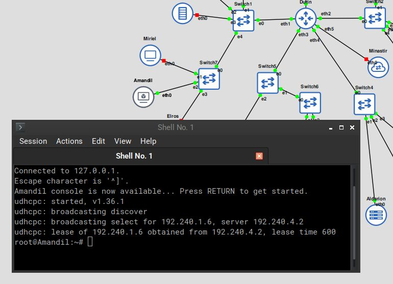

# Jarkom-Modul-2-2025-K58

| Nama                        | NRP        |
| --------------------------- | ---------- |
| Thio Billy Amansyah         | 5027231007 |
| Ivan Syarifuddin            | 5027241045 | 

## No.1
**SOAL:** Di awal Zaman Kedua, setelah kehancuran Beleriand, para Valar menugaskan untuk membangun kembali jaringan komunikasi antar kerajaan. Para Valar menyalakan Minastir, Aldarion, Erendis, Amdir, Palantir, Narvi, Elros, Pharazon, Elendil, Isildur, Anarion, Galadriel, Celeborn, Oropher, Miriel, Amandil, Gilgalad, Celebrimbor, Khamul, dan pastikan setiap node (selain Durin sang penghubung antar dunia) dapat sementara berkomunikasi dengan Valinor/Internet (nameserver 192.168.122.1) untuk
menerima instruksi awal


**PENJELASAN:** Bentuk topologi sesuai contoh. 


Berikan Ip address static pada sambungan router (Durin) dengan subnet2nya, lalu tentukan Ip dynamic pada sambungan router ke nat serta tetapkan `192.168.122.1` sebagai resolver

```
# DHCP config for eth0
auto eth0
iface eth0 inet dhcp

# Static config for eth1
auto eth1
iface eth1 inet static
	address 192.240.1.1
	netmask 255.255.255.0

# Static config for eth2
auto eth2
iface eth2 inet static
	address 192.240.2.1
	netmask 255.255.255.0

# Static config for eth3
auto eth3
iface eth3 inet static
	address 192.240.3.1
	netmask 255.255.255.0

# Static config for eth4
auto eth4
iface eth4 inet static
	address 192.240.4.1
	netmask 255.255.255.0

# Static config for eth5
auto eth5
iface eth5 inet static
	address 192.240.5.1
	netmask 255.255.255.0
	up echo nameserver 192.168.122.1 > /etc/resolv.conf
```

Berikan IP address static pada setiap node client dan server. Lalu tetapkan `192.168.122.1` sebagai resolver

```
# Static config for eth0
auto eth0
iface eth0 inet static
	address 192.240.1.4
	netmask 255.255.255.0
	gateway 192.240.1.1
	up echo nameserver 192.168.122.1 > /etc/resolv.conf
```

Masukkan iptables rule pada router (Durin) agar bisa menjadi nat device dan meneruskan paket ke internet. .

```
iptables -t nat -A POSTROUTING -o eth0 -j MASQUERADE -s 192.240.0.0/16
```

## No.2
**SOAL:** Raja Pelaut Aldarion, penguasa wilayah Númenor, memutuskan cara pembagian tanah client secara dinamis. Ia menetapkan:

○ Client Dinamis Keluarga Manusia: Mendapatkan tanah di rentang [prefix ip].1.6 - [prefix ip].1.34 dan [prefix ip].1.68 - [prefix ip].1.94.

○ Client Dinamis Keluarga Peri: Mendapatkan tanah di rentang [prefix ip].2.35 - [prefix ip].2.67 dan [prefix ip].2.96 - [prefix ip].2.121.

○ Khamul yang misterius: Diberikan tanah tetap di [prefix ip].3.95, agar keberadaannya selalu diketahui. Pastikan Durin dapat menyampaikan dekrit ini ke semua wilayah yang terhubung dengannya

**PENJELASAN:** Install dan konfigurasi dhcp server pada node Aldarion.
```
### Konfigurasi /root/.bashrc
[[ "$(dhcpd --version)" ]] || apt update -y && apt install isc-dhcp-server -y

cp -f /root/conf-bak/isc-dhcp-server /etc/default
cp -f /root/conf-bak/dhcpd.conf /etc/dhcp

service isc-dhcp-server start

### KOnfigurasi /etc/default/isc-dhcp-server
INTERFACESv4="eth0"

### KOnfigurasi /etc/dhcp/dhcpd.conf
default-lease-time 600;
max-lease-time 7200;
subnet 192.240.1.0 netmask 255.255.255.0 {
    range 192.240.1.6 192.240.1.34;
    range 192.240.1.68 192.240.1.94;
    option routers 192.240.1.1;
    option domain-name-servers 192.168.122.1;
    option broadcast-address 192.240.1.255;
}

subnet 192.240.2.0 netmask 255.255.255.0 {
    range 192.240.2.35 192.240.2.67;
    range 192.240.2.96 192.240.2.121;
    option routers 192.240.2.1;
    option domain-name-servers 192.168.122.1;
    option broadcast-address 192.240.2.255;
}

subnet 192.240.3.0 netmask 255.255.255.0 { }
subnet 192.240.4.2 netmask 255.255.255.255 { }
host Khamul {
    hardware ethernet 02:42:47:72:aa:00;
    fixed-address 192.240.3.95;
}
```

Install dan konfigurasi dhcp relay pada router (Durin)

```
### Konfigurasi /root/.bashrc
[[ "$(ls /etc/default/isc-dhcp-relay)" ]] || apt update && apt install isc-dhcp-relay -y

cp -f /root/conf-bak/isc-dhcp-relay /etc/default
cp -f /root/conf-bak/sysctl.conf /etc

service isc-dhcp-relay start

iptables -t nat -A POSTROUTING -o eth0 -j MASQUERADE -s 192.240.0.0/16

### Konfigurasi /etc/default/isc-dhcp-relay
# What servers should the DHCP relay forward requests to?
SERVERS="192.240.4.2"

# On what interfaces should the DHCP relay (dhrelay) serve DHCP requests?
INTERFACES="eth4 eth3 eth2 eth1"
```

Bukti dhcp server dan relay telah bekerja.




## No.3
**SOAL:** Untuk mengontrol arus informasi ke dunia luar (Valinor/Internet), sebuah menara pengawas, Minastir didirikan. Minastir mengatur agar semua node (kecuali Durin) hanya dapat mengirim pesan ke luar Arda setelah melewati pemeriksaan di Minastir.

**PENJELASAN:**
