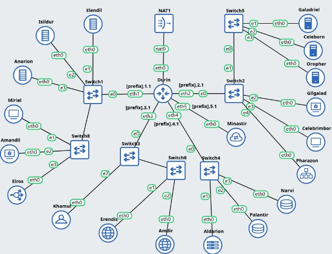

# Jarkom-Modul-2-2025-K58

| Nama                        | NRP        |
| --------------------------- | ---------- |
| Thio Billy Amansyah         | 5027231007 |
| Ivan Syarifuddin            | 5027241045 | 

## No.1
**SOAL:** Di awal Zaman Kedua, setelah kehancuran Beleriand, para Valar menugaskan untuk membangun kembali jaringan komunikasi antar kerajaan. Para Valar menyalakan
Minastir, Aldarion, Erendis, Amdir, Palantir, Narvi, Elros, Pharazon, Elendil, Isildur, Anarion, Galadriel, Celeborn, Oropher, Miriel, Amandil, Gilgalad, Celebrimbor,
Khamul, dan pastikan setiap node (selain Durin sang penghubung antar dunia) dapat sementara berkomunikasi dengan Valinor/Internet (nameserver 192.168.122.1) untuk
menerima instruksi awal



**PENJELASAN:** Bentuk topologi sesuai contoh. 


Berikan Ip address static pada sambungan router dengan subnet2nya, lalu tentukan Ip dynamic pada sambungan router ke nat.

```
# DHCP config for eth0
auto eth0
iface eth0 inet dhcp

# Static config for eth1
auto eth1
iface eth1 inet static
	address 192.240.1.1
	netmask 255.255.255.0
	up echo nameserver 192.168.122.1 > /etc/resolv.conf

# Static config for eth2
auto eth2
iface eth2 inet static
	address 192.240.2.1
	netmask 255.255.255.0
	up echo nameserver 192.168.122.1 > /etc/resolv.conf

# Static config for eth3
auto eth3
iface eth3 inet static
	address 192.240.3.1
	netmask 255.255.255.0
	up echo nameserver 192.168.122.1 > /etc/resolv.conf

# Static config for eth4
auto eth4
iface eth4 inet static
	address 192.240.4.1
	netmask 255.255.255.0
	up echo nameserver 192.168.122.1 > /etc/resolv.conf

# Static config for eth5
auto eth5
iface eth5 inet static
	address 192.240.5.1
	netmask 255.255.255.0
	up echo nameserver 192.168.122.1 > /etc/resolv.conf
```

Berikan IP address static pada setiap node client dan server. 


Masukkan iptables rule pada router `Durin`  
